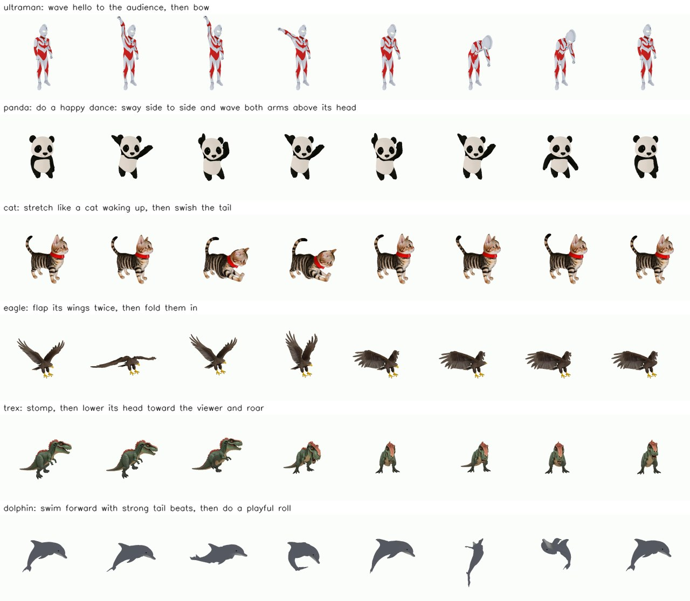

# Animation Agent

Type what a rigged 3D character should do, in plain English, and get a video of it doing that.

```
[panda] command > do a happy dance: sway side to side and wave both arms above its head
Animating ... (usually 1-3 minutes; Ctrl+C to cancel)
  front view: B (azim 90)
  step 0: preview_pose arms up, sway right
  ...
  step 11: submit_plan
Done in 137s:
  runs\panda_20261002_003346\animation.mp4
```



Claude (Opus) acts as the animator: it plans keyframes, renders and inspects its own poses, and fixes them before submitting. Code does the parts a language model is bad at: measuring how each joint moves, forward kinematics and skinning, keeping feet on the floor, interpolation, and framing the camera. It works on **any rig**, including humanoids, quadrupeds, birds, fish, and auto-rigged meshes with generic `bone_N` names. It never changes the mesh, so the character stays exactly the same; only its skeleton moves.

## Quick start

```bash
conda activate VideoArticulation          # Python 3.10, PyTorch + PyTorch3D with CUDA
pip install -r requirements.txt
set KMP_DUPLICATE_LIB_OK=TRUE             # Windows: avoids the duplicate-OpenMP abort
set ANTHROPIC_API_KEY=sk-ant-...          # asked for at startup if missing
python agent.py
```

`agent.py` lists every character in `asset/`. Pick one by number or name, then type commands:

| input | effect |
|---|---|
| any English text | animate the current character, e.g. `wave hello, then bow` |
| `:c` | choose another character |
| `:o` | open the last video |
| `:q` | quit |

Each command writes its outputs to `runs/<character>_<timestamp>/`, with `animation.mp4` at the top level.

### One-shot CLI

```bash
python animate.py --command "stretch like a cat waking up, then swish the tail" \
    --mesh_path asset/cat_texture_obj/cat_texture.obj \
    --rig_path  asset/cat_texture_obj/rig/cat_ori_rig.txt
```

Useful flags:

- `--claude_model`: default `claude-opus-5-5`.
- `--max_steps`: tool turns Claude gets; default 14.
- `--fps`: frames per second of the output video.
- `--cam_azim`: fix the camera angle.
- `--from_poses runs/.../poses.pt`: re-render a previous run without calling the API.

## How it works (`director.py`)

1. **Facing.** The character is rendered from four sides, and Claude picks the one that shows its front. This fixes the body frame: forward, up, and left. When the rig uses `L_`/`R_` names, the result is cross-checked against them.
2. **Bone names.** UniRig rigs name bones `bone_12`, not `left_wing`. For those rigs, every bone's skin region is painted red, and the parts that move with it orange. Claude then names each bone, for example `bone_37 = left wing`.
3. **Motion table, measured instead of guessed.** Each joint is rotated +30° about x, y and z, and the code records where the part moves in the character's own frame, for example `Spine01 z+ -> backward`. Claude reads this table instead of reasoning about axis signs, which is where language models usually go wrong.
4. **Tool-use loop.** Claude has three tools:
   - `preview_pose` renders one pose from the video camera and from the side.
   - `preview_plan` renders every keyframe of a plan.
   - `submit_plan` submits the plan.

   Claude tries the hard poses first, such as arms overhead or a wing at full flap. It then previews the whole sequence and submits it only when every action in the command passes a strict check: each must be clearly visible, point the right way, and not pass through the body.
5. **Render.**
   - Keyframes are interpolated: joints are slerped with ease-in and ease-out, and the root is lerped.
   - The lowest point of the body stays on the floor, so a crouch never floats.
   - A tracking camera follows the character at a fixed size, filming from three-quarter front. Long-bodied characters are filmed from closer to the side.
   - The output is an mp4 at 24 fps.

`animate.py --mode video` is an alternative pipeline. It turns the command into a reference video with Kling (fal.ai, needs `FAL_KEY`), then fits each keyframe to that video with the silhouette search in `agent_fb_07.py`.

## Adding your own character

A character is a folder `asset/<name>_texture_obj/` that contains two files:

- `<name>_texture.obj`: the mesh, with its texture.
- `rig/<name>_ori_rig.txt`: lines of the form `joints <name> x y z`, `root <name>`, `skin <vertex> <joint> <weight> ...`, and `hier <parent> <child>`, in Y-up coordinates.

To rig a new mesh automatically, run UniRig, then convert its output:

```bash
cd rigging
bash run_unirig.sh /path/to/model.glb                       # -> model_skin.fbx
blender --background --python blender_read_fbx.py -- --filepath /path/to/model.glb
```

UniRig needs its own environment; see `rigging/UniRig/requirements.txt` and its checkpoints.

## Repository layout

| file | role |
|---|---|
| `agent.py` | interactive entry point |
| `animate.py` | one-shot CLI, interpolation, video rendering, video mode |
| `director.py` | facing, bone naming, motion table, Claude tool-use loop, cameras |
| `agent_fb_07.py` | silhouette and Claude pose fitting to a reference frame (video mode) |
| `rigging/model.py` | rig model: forward kinematics and linear blend skinning |
| `rendering/`, `utils/` | PyTorch3D renderer, camera, mesh and rig I/O |
| `rigging/UniRig/` | automatic rigging for new meshes |
| `asset/` | 32 rigged example characters |

## Limitations

- Motion comes from keyframes plus interpolation, with no physics and no learned motion prior. Long locomotion cycles and dances with weight shifts look stiff, and feet can slide.
- Output quality depends on the rig. For example, the eagle has a single bone per wing, so it can sweep its wings but cannot fold them.
- Large rotations can show linear-blend-skinning artifacts at shoulders and hips.
- Each command makes up to about 16 Opus calls and takes 1–3 minutes.

## Credits

Built on the AnimaMimic rigging and rendering code, and on [UniRig](https://github.com/VAST-AI-Research/UniRig) for automatic rigging.
